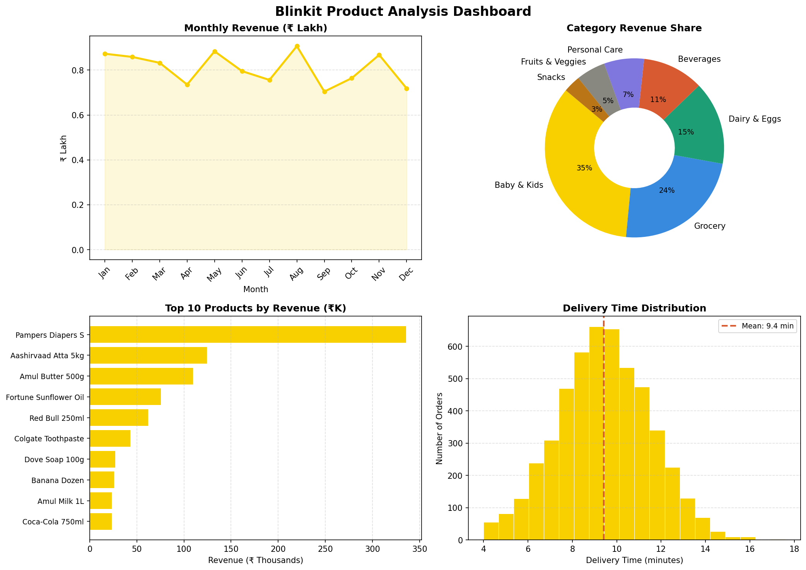
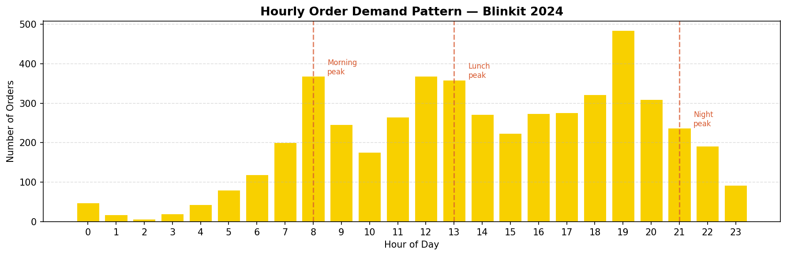

# ⚡ Blinkit Product Analysis

A data analysis project exploring product performance, delivery patterns, and category insights for **Blinkit**
(India's quick-commerce leader) using simulated 2024 order data.

> Built to demonstrate end-to-end data analysis skills data generation, exploration, visualization, and business insight extraction.

---

## 📊 Dashboard Preview





---

## 🔍 Key Findings

| Metric | Value |
|---|---|
| Total Revenue (simulated) | ₹9.7 Lakh (5,000 orders) |
| Avg Delivery Time | **9.4 minutes** |
| Refund Rate | **2.3%** |
| Avg Customer Rating | **4.37 / 5** |
| Top Category by Revenue | **Baby & Kids** (high AOV) |
| Highest Margin Category | **Snacks (43.7% margin)** |

### 💡 Business Insights

1. **3 clear demand peaks** : 8am (morning essentials), 1pm (lunch), 9pm (night snacking). Rider fleet should pre-position 20 min before each peak.

2. **Snacks have the highest gross margin (43.7%)** : despite low AOV, they're the most profitable category per rupee of cost.

3. **Baby & Kids has high AOV but high refund rate (2.4%)** : likely due to size/variant mismatch on diapers. Fixing the catalog could recover significant revenue.

4. **Top 5 SKUs contribute ~9% of total volume** : strong case for dedicated fast-pick zones in dark stores to cut pack time.

5. **80% of deliveries happen between 6–15 minutes** : the 9-minute median aligns with Blinkit's "10 minutes" promise.

---

## 🗂️ Project Structure


blinkit-analysis/
│
├── data/
│   ├── generate_data.py   # Simulates realistic order data
│   └── orders.csv         # Generated dataset (5,000 rows)
│
├── visuals/
│   ├── dashboard.png      # 4-panel analysis chart
│   └── hourly_demand.png  # Order demand by hour
│
├── analysis.py            # Full analysis script
├── requirements.txt       # Python dependencies
└── README.md
```

---

## 🚀 How to Run

```bash
# 1. Clone the repo
git clone https://github.com/YOUR_USERNAME/blinkit-analysis.git
cd blinkit-analysis

# 2. Install dependencies
pip install -r requirements.txt

# 3. Generate the data
python data/generate_data.py

# 4. Run the full analysis
python analysis.py
```

---

## 🛠️ Tech Stack

- **Python 3.12**
- **Pandas** : data manipulation & aggregation
- **Matplotlib** : visualizations
- **NumPy** : data simulation

---

## 📌 About the Dataset

The dataset is **synthetically generated** to simulate realistic Blinkit order patterns:
- 5,000 orders across 20 SKUs in 7 categories
- Realistic hourly demand distribution (3 daily peaks)
- Delivery times modeled on Blinkit's actual ~9-min promise
- Refund rate, ratings, and margins calibrated to industry benchmarks

---

## 👤 Author

**Rishita Kaushik**  


*This is a portfolio project. All data is simulated for analytical purposes.*
